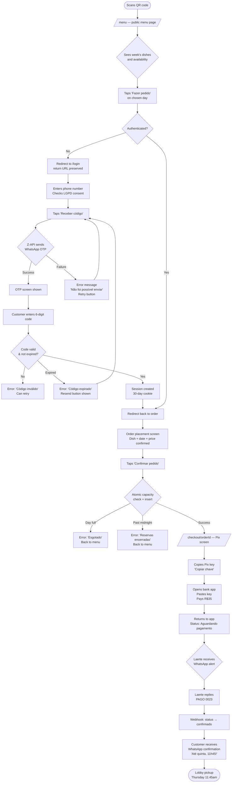
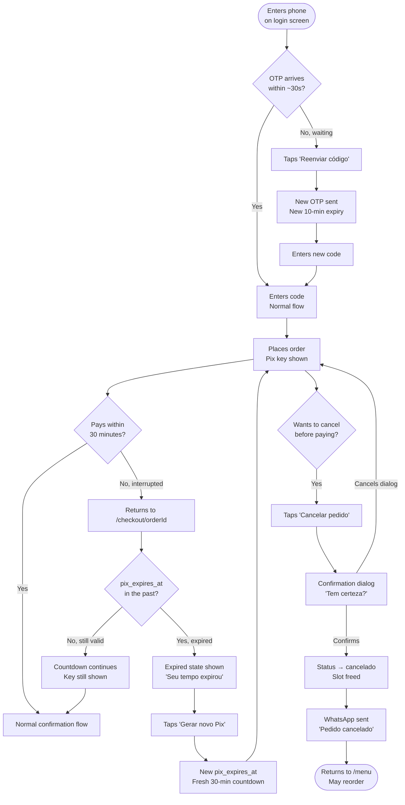
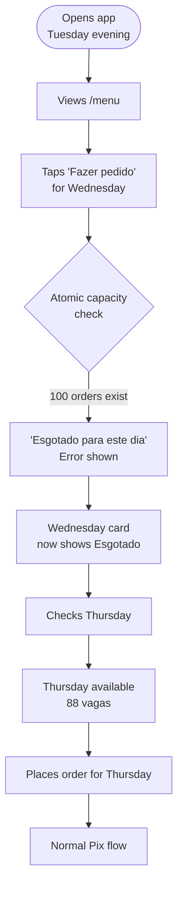

# UX Design Specification — Marmita do Seu Laerte

**Author:** Lucas
**Date:** 2026-04-07

---

<!-- UX design content will be appended sequentially through collaborative workflow steps -->

## Executive Summary

### Project Vision

Marmita do Seu Laerte is a mobile-first web app that lets corporate workers in Faria Lima order a daily home-cooked marmita from Seu Laerte — a specific cook with 40+ years of experience — for lobby pickup at 11:45am. The platform's role is to make ordering frictionless and amplify the emotional bond between customer and cook through thoughtful touchpoints. The UX must communicate warmth, trust, and simplicity in a context where the user is on their phone, in a hurry, and encountering the brand for the first time.

### Target Users

**Ana — The Convert (Primary)**
28, financial analyst. Discovers via lobby social proof, orders on her phone in under 3 minutes. Values speed and emotional resonance. Will return if the first experience is smooth and the food delivers. Represents the happy path: discover → sign up → order → pay → pick up → rate.

**Rafael — The Almost Customer (Edge Case)**
34, lawyer. Impatient and phone-first. Will not call for support — if something breaks, he leaves. Represents the recovery path: OTP resend, Pix expiry, order cancellation. Every dead end needs a graceful exit.

**Laerte — The Ops User**
60s, the cook and face of the brand. Not a tech power user. His UX is primarily WhatsApp (PAGO confirmation, order alerts) and a simple admin panel. The admin must be learnable in one session and never require support.

### Key Design Challenges

1. **Trust in 60 seconds**: The menu page is the first impression from a QR code. It must communicate Seu Laerte's warmth, food quality, and legitimacy before any interaction — with no pre-existing brand equity.
2. **Pix checkout under pressure**: The copy-key-and-pay flow happens on mobile with a 30-minute clock. The key must be impossible to miss, trivial to copy, and the countdown must feel helpful not alarming.
3. **Edge case recovery without frustration**: OTP delays, Pix expiry, and sold-out days are real scenarios (Rafael's journey). Each must have a clear, warm, Portuguese-language exit — no dead ends.
4. **Admin simplicity for a non-tech user**: Laerte's menu management, notification scheduling, and order count view must be operable without training.

### Design Opportunities

1. **Warmth as a design system**: Seu Laerte's face, name, and food can make every screen feel like a personal relationship. This is a structural differentiator from food aggregators with clinical UI.
2. **Sunday menu reveal as delight**: The weekly WhatsApp notification is an engagement ritual. Designing its format thoughtfully creates anticipation, not just information delivery.
3. **Laerte's voice in the product**: Confirmation messages, error states, and empty states can carry Seu Laerte's voice ("Até lá! 🍱") rather than generic system copy — threading the brand into every interaction.

## Core User Experience

### Defining Experience

The core user action is placing an order in under 3 minutes from a mobile phone. Everything — authentication, menu display, checkout, payment — exists to serve this single loop. The product is not a food delivery app; it is a pre-order system built around a specific person. The platform's job is to get out of the way and let that human connection happen.

### Platform Strategy

**Primary platform:** Mobile-first progressive web app — no app store install required.
- **Primary targets:** Mobile Safari (iOS) and Mobile Chrome (Android) — dominant in Faria Lima's corporate demographic
- **Secondary:** Desktop Chrome, Safari, Firefox (users ordering from work computers)
- **Input model:** Touch-first; all tap targets minimum 44×44px
- **Platform capability to leverage:** Clipboard API for one-tap Pix key copy on mobile
- **Constraint:** No offline requirement; always-online ordering context
- **SEO:** Public pages (menu, landing) are SSR and fully indexable; auth/order pages are `noindex`

### Effortless Interactions

The following interactions must require zero cognitive effort:

- **Menu browsing**: Public, no login, loads instantly — a visitor from a QR code sees food and prices before they've decided anything
- **Phone auth**: Feels like receiving a WhatsApp — because it is; one field, one message, one code
- **Pix key copy**: Single tap to clipboard; no manual text selection on mobile
- **Meal rating**: One tap on a star — no form, no confirmation screen
- **Laerte's payment confirmation**: One WhatsApp reply (`PAGO 0023`) — he never opens any app

### Critical Success Moments

These are the make-or-break interactions where the experience is won or lost:

1. **First arrival (menu page)**: A visitor from a QR code decides in under 10 seconds whether Seu Laerte is real and worth trying. Trust is the only goal of this screen.
2. **OTP delivery**: The WhatsApp code must arrive before impatience sets in (~30 seconds). This is the highest-risk technical moment in the entire product.
3. **Payment confirmation**: "Pedido confirmado! Quinta-feira, 11h45 no lobby. Até lá! 🍱 — Seu Laerte" — this message is the moment the customer commits. Laerte's name and voice must be in it.
4. **Lobby pickup**: Laerte saying "Ana?" and handing over the bag. Every UX decision exists to get the customer to this moment without friction.

### Experience Principles

1. **Speed over features**: The order flow must be completable in under 3 minutes. No screen adds a step that isn't essential.
2. **Laerte's voice, not system copy**: Every message — confirmation, error, empty state — sounds like it came from a person who cooks for you, not from software.
3. **Recovery over perfection**: OTP delays, expired Pix, sold-out days will happen. Every dead-end has a warm, clear Portuguese-language exit. Rafael must never have to guess what to do next.
4. **Mobile canvas, desktop bonus**: Every layout decision is made at 375px first. Desktop is an enhancement, never the baseline.
5. **Trust before transaction**: The menu page earns trust before asking for a phone number. The sign-up flow comes after desire, not before.

## Desired Emotional Response

### Primary Emotional Goals

The dominant experience emotion is **warmth** — the feeling of ordering from a person who cooks for you, not from a platform. Supporting this is **anticipation**: the building excitement from Sunday's menu reveal to Thursday's lobby pickup. These two emotions thread through every screen and notification.

The product must never feel like software. Every confirmation, error message, and empty state should feel like it was written by someone who is going to hand you lunch.

### Emotional Journey Mapping

| Moment | Target Emotion | Risk to Avoid |
|---|---|---|
| Menu page (first visit from QR) | Curious → genuinely convinced | Skeptical ("is this legitimate?") |
| Phone number entry | Calm, simple | Hesitant about sharing data |
| OTP arrival via WhatsApp | Smooth, fast, reassured | Anxious ("the code isn't coming") |
| Order placed | Anticipation locked in | Uncertain about what happens next |
| Pix key displayed | Calm, confident | Pressured by the countdown |
| Payment confirmed by Laerte | Relief + delight | — (this moment must land perfectly) |
| Sunday menu reveal (WhatsApp) | Excited, planning ahead | Annoyed (spammy) |
| Morning dish story (WhatsApp) | Hungry, looking forward to 11:45 | Ignored |
| Lobby pickup | Warm, seen, belonging | Awkward or impersonal |
| 1pm rating prompt | Affectionate, happy to share | Obligated, surveyed |
| Error / edge case | Understood and guided | Frustrated, stuck, abandoned |

### Micro-Emotions

**Trust vs. Skepticism**
Highest stakes on the menu page. The visitor has no prior brand relationship. Seu Laerte's face, name, and real food descriptions must establish legitimacy in seconds. Generic UI patterns undermine this — every visual choice either builds or erodes trust.

**Confidence vs. Anxiety**
The 30-minute Pix countdown exists as a business constraint. From the user's perspective it must feel like a helpful guide ("you have time"), not a threat. The design language around the timer — color, size, copy — determines which of these it becomes.

**Belonging vs. Transactional**
The payment confirmation is the pivot point. "Pedido confirmado." feels transactional. "Pedido confirmado! Quinta-feira, 11h45 no lobby. Até lá! 🍱 — Seu Laerte" feels like a person. Every confirmation message must be written as the latter.

**Delight vs. Obligation**
The 1pm rating prompt comes when the customer just finished eating something they (hopefully) loved. The copy should invoke that feeling — "Como foi o almoço hoje?" is conversational. A star rating form is clinical. One tap, no friction, no follow-up — they should want to answer, not feel surveyed.

### Design Implications

- **Trust → visual warmth**: Seu Laerte's photo, hand-written-style type accents, food photography over stock imagery, warm earth tones (not clinical white/blue)
- **Anticipation → countdown framing**: Dish story notifications should build hunger, not just inform. Copy like "Hoje é dia de escondidinho 🍲" beats "Seu prato de hoje"
- **Confidence in Pix flow → generous timer display**: Show "Você tem 28 minutos" not a red bar at 2 minutes. Positive framing of remaining time.
- **Belonging → Laerte's name in every touchpoint**: Not "The system has confirmed your order" — "Até lá! — Seu Laerte"
- **Recovery emotions → warm error copy**: "Código expirado. Solicite um novo — é rapidinho!" vs "Error: token expired"

### Emotional Design Principles

1. **Person-first copy**: Every message sounds like Seu Laerte wrote it, not a developer. Warmth is not decoration — it is the product.
2. **Time as an ally**: The Pix countdown and midnight cutoff are constraints. Present them as helpful information, never as pressure.
3. **No dead ends, no silence**: Every error state has a next action. Rafael must never be left staring at a failure with nowhere to go.
4. **Earn the rating**: The 1pm prompt works only if the meal was good. The UX's job is to make rating feel like a natural expression of satisfaction, not a task.
5. **The lobby moment is the product**: Digital UX is the bridge to a physical, human moment. Design every screen in service of that handoff.

## UX Pattern Analysis & Inspiration

### Inspiring Reference: The Neighborhood Restaurant Regular

The primary UX inspiration for Marmita do Seu Laerte is not a digital product — it is a physical experience: the neighborhood restaurant where the waiter already knows you. "Same as usual?" You nod. Done.

This is the emotional and interaction model the product aspires to. Every UX decision should be tested against it: does this feel like that waiter, or does it feel like a marketplace?

### Transferable UX Patterns

**Recognition over discovery**
A returning customer should never feel like a new visitor. The menu is the landing page — not a marketing pitch. Seu Laerte's dishes are presented as curated choices from someone you trust, not a browsable catalog.

**Minimal words, maximum context**
The waiter doesn't explain the menu — you already know the restaurant. UI copy should be terse and warm. "Fazer pedido" not "Add to cart and proceed to checkout." "Pedido confirmado!" not "Your transaction has been processed."

**The person is the product**
Laerte's name, face, and voice appear at every touchpoint. Dish descriptions sound like he chose them because he's proud of them, not because a copywriter wrote them. This is the pattern that no competitor can replicate.

**Accumulating familiarity**
First visit: earn trust. Second visit: feel recognized. Third visit: feel like a regular. The MVP establishes this with 30-day sessions (no re-login friction), personalized confirmations with the customer's name, and eventually (Phase 2) one-tap reorder from history.

**Service, not sales**
No upsells. No "you might also like." No upgrade prompts. No re-engagement pressure. The product's job is to reliably serve — every time, without asking for more than necessary.

### Anti-Patterns to Avoid

- **Marketplace patterns**: categories, search, filters, trending dishes, "customers also ordered" — this is one cook, one dish per day; browsing is not the experience
- **Gamification**: streaks, points, badges, loyalty tiers — the relationship IS the loyalty program
- **Checkout friction**: multi-step wizards, progress bars, "review your order" confirmation screens — order → Pix → done
- **Impersonal system copy**: "Your order #0023 has been processed" vs. "Até quinta! 🍱 — Seu Laerte"
- **Aggressive re-engagement**: push notifications for inactivity, urgency manipulation ("only 3 spots left!") — trust is the retention mechanism, not pressure
- **Upsell at checkout**: no add-ons, no upgrades, no "complete your meal"

### Design Inspiration Strategy

**Adopt:**
- Brevity and warmth in all copy — every string written as if Laerte said it
- Recognition-first navigation — returning users see the menu, not a landing page
- One primary action per screen — no competing CTAs

**Adapt:**
- WhatsApp's conversation UI as a mental model for the notification experience: feels like a message from someone you know, not a marketing blast
- The restaurant bill's invisibility: payment should feel like the least interesting part of the experience — get it done, move on

**Avoid entirely:**
- Any pattern borrowed from food delivery marketplaces (iFood, Rappi, Uber Eats)
- Any pattern that signals "platform" rather than "person"

## Component Strategy

### Design System Components (shadcn/ui — install as needed)

| Component | Stories | Notes |
|---|---|---|
| `Button` | All | `variant="default"` (terracotta), `variant="ghost"` (cancel), `variant="outline"` |
| `Input` | 1.2, 1.3, 2.2 | Phone number, admin forms |
| `Form` + `FormField` | 1.2, 1.3, 2.2, 4.4 | React Hook Form integration, Zod validation display |
| `Card` + `CardContent` | 2.1, 3.2, 4.5 | Menu day cards, order status, admin list |
| `Badge` | 2.1, 4.5 | Availability count, order status labels |
| `Dialog` | 3.4 | Cancel order confirmation |
| `Sonner` (Toast) | All mutation flows | Server Action success/error feedback |
| `Label` | 1.2, 2.2 | Form field labels |
| `Separator` | Admin pages | Section dividers |

All installed via `npx shadcn@latest add [component]` — components land in `src/components/ui/`.

### Custom Components

#### MenuDayCard

**Purpose:** Display one delivery day with dish info, availability, and order CTA. The most-rendered component in the product — appears 5 times on the menu page.

**Anatomy:**
- Day label (e.g., "Segunda · 7 de abril") — `text-sm font-semibold text-muted-foreground`
- Dish name — `text-lg font-bold text-foreground`
- Dish description — `text-sm text-muted-foreground` (2-line clamp on mobile)
- Availability line — slot count in amber or "Esgotado" in muted
- CTA button — "Fazer pedido" (primary) or disabled "Esgotado" badge

**States:** `available`, `sold-out`, `past-cutoff`, `loading` (skeleton shimmer)

**Props:** `deliveryDate`, `dishName`, `description`, `availableSlots`, `maxSlots`, `onOrder: () => void`

**Accessibility:** `role="article"`, `aria-label="Prato de [dia]: [prato]"`, button focusable with Enter/Space

**Location:** `src/components/features/MenuDayCard.tsx`

---

#### OtpInput

**Purpose:** 6-digit OTP entry optimized for mobile — large touch targets, auto-advance between digits, paste-from-clipboard support.

**Anatomy:** 6 individual digit boxes (`w-12 h-14`), auto-focus next on entry, paste splits across boxes, backspace navigates back.

**States:** `idle`, `filled`, `error` (shake animation, destructive border), `loading` (disabled during server action)

**Accessibility:** `aria-label="Código de verificação"` on group; individual inputs `aria-label="Dígito N de 6"`; `inputmode="numeric"`, `autocomplete="one-time-code"`

**Location:** `src/components/features/OtpInput.tsx`

---

#### PixKeyDisplay

**Purpose:** Show the Pix key in a prominent, copy-ready box with the 30-minute countdown. The make-or-break component of the payment flow.

**Anatomy:** Amber-bordered container, monospace key value, "Copiar chave Pix" button, countdown in positive framing ("Você tem X minutos").

**States:** `active`, `copied` (button shows "Copiado! ✓" for 1.5s), `expired` (key hidden, "Gerar novo Pix" shown), `loading`

**Countdown rule:** Show minutes when ≥ 2 min remain. Show MM:SS when < 2 min. Never show alarming red — timer goes muted gray at expiry.

**Accessibility:** `aria-live="polite"` countdown announced every 60s; copy button `aria-label="Copiar chave Pix"`

**Location:** `src/components/features/PixKeyDisplay.tsx`

---

#### StarRating

**Purpose:** 1–5 star tap input for meal rating. Tap = select = submit. No separate submit button.

**Anatomy:** 5 stars at `w-11 h-11` (44px), amber filled / muted empty. Tapping immediately submits.

**States:** `idle`, `hovered(n)` (desktop only), `selected(n)`, `submitted` (frozen + "Obrigado! ✓")

**Accessibility:** `role="radiogroup"`, each star `role="radio"` with `aria-label="N estrelas"`, arrow keys navigate, Enter/Space selects

**Location:** `src/components/features/StarRating.tsx`

---

#### OrderStatusBadge

**Purpose:** Color-coded status pill on checkout page and admin order list.

| Status | Label | Style |
|---|---|---|
| `aguardando_pagamento` | Aguardando pagamento | Amber bg, dark text |
| `confirmado` | Confirmado | Green bg, white text |
| `entregue` | Entregue | Muted bg, muted text |
| `cancelado` | Cancelado | Muted bg, muted text |

Built on shadcn/ui `Badge` with custom variant per status.

**Location:** `src/components/features/OrderStatusBadge.tsx`

### Component Implementation Strategy

- All custom components built from shadcn/ui primitives and Tailwind tokens — no additional dependencies
- Custom components in `src/components/features/` — separated from shadcn/ui's `src/components/ui/`
- Built just-in-time per story, not upfront

### Implementation Roadmap

| Epic | Component | Story |
|---|---|---|
| Epic 1 | `OtpInput` | 1.3 |
| Epic 2 | `MenuDayCard` | 2.1 |
| Epic 3 | `PixKeyDisplay`, `OrderStatusBadge` | 3.2 |
| Epic 5 | `StarRating` | 5.1 |

## User Journey Flows

### Journey 1: New Customer Happy Path (Ana)

**Trigger:** Visitor arrives at `/menu` via QR code from a lobby flyer.



**Key UX decisions:**
- Return URL preserved through auth redirect — no lost context
- OTP screen stays visible during resend flow — no full page reset
- "Confirmar pedido" is a single screen with no surprises — dish, date, price, one button
- Pix key in amber-bordered box, one-tap copy — no manual selection
- Status page reassures during the wait: "seu pedido está garantido assim que o pagamento for confirmado"

---

### Journey 2: Edge Case Recovery (Rafael)

**Trigger:** OTP delay, Pix expiry, or mid-flow interruption.



**Key UX decisions:**
- "Reenviar código" visible immediately on OTP screen — no timer delay before showing it
- Expired Pix state replaces key display entirely — Rafael never sees a stale key
- Cancel confirmation dialog prevents accidental taps — one extra step is worth it here
- Cancellation WhatsApp confirmation is non-blocking — order still cancels even if Z-API is down

---

### Journey 3: Laerte's Payment Confirmation (Ops)

**Trigger:** New order placed by any customer.

```mermaid
flowchart TD
    A([Customer places order]) --> B[Laerte receives\nWhatsApp alert\n'Novo pedido! #0023 — Ana...']
    B --> C{Customer pays\nvia bank app}
    C -- Pays --> D[Laerte cross-references\nbank notification with alert]
    D --> E[Replies on WhatsApp\n'PAGO 0023']
    E --> F[Z-API webhook fires\n/api/webhooks/zapi]
    F --> G{Token valid?}
    G -- No --> H[401 returned\nLogged]
    G -- Yes --> I{Sender =\nLAERTE_PHONE?}
    I -- No --> J[Message logged\n200 returned silently]
    I -- Yes --> K{Message matches\nPAGO pattern?}
    K -- No --> J
    K -- Yes --> L{Order found\nby display_id?}
    L -- Not found --> M[Error logged\n200 returned\nNo customer impact]
    L -- Found, already confirmado --> N[Idempotent\n200 returned\nNo duplicate notification]
    L -- Found, aguardando --> O[Status → confirmado]
    O --> P[Customer WhatsApp\n'Pedido confirmado!\nAté quinta, 11h45! 🍱']
    P --> Q([Customer confirmed\nLaerte prepared])

    R([Midnight cron fires]) --> S[/api/cron/nightly-email]
    S --> T[Fetch tomorrow's orders\nconfirmado + aguardando]
    T --> U[Generate Excel\nNome, Telefone, Prato, Status]
    U --> V[Send via Resend\nto LAERTE_EMAIL]
    V --> W{Send success?}
    W -- Yes --> X([Laerte receives email\nReady to shop])
    W -- No --> Y[Log error\nSend WhatsApp fallback\nto LAERTE_PHONE]
```

**Key UX decisions:**
- Laerte's entire workflow is WhatsApp — zero app interaction required
- Human-readable 4-digit order ID (`#0023`) is critical — UUIDs would break this
- Idempotent webhook prevents duplicate confirmations if Laerte sends PAGO twice
- Excel email: sorted by display_id, columns match how Laerte thinks about his list

---

### Journey 4: Capacity Edge Case (Camila)



---

### Journey Patterns

**Entry pattern — trust before auth:**
Public menu → desire formed → "Fazer pedido" → auth (if needed) → return to flow. Auth is never the entry point; it is a gate that opens only when the user has already decided to order.

**Recovery pattern — warm dead ends:**
Every error state (OTP expired, Pix expired, day sold out, capacity full) has:
1. A clear Portuguese explanation of what happened
2. A single, obvious next action
3. No loss of progress (return URL preserved, order slot held)

**Confirmation pattern — Laerte's voice closes the loop:**
Every significant action ends with a WhatsApp from "Seu Laerte". The channel is WhatsApp because that's where the customer already lives.

### Flow Optimization Principles

1. **Zero re-entry after auth**: Return URL always preserved — customers land exactly where they were
2. **Positive time framing**: "Você tem 28 minutos" not "2 minutes remaining" — the clock is a helper
3. **Idempotent confirmations**: Duplicate PAGO commands handled gracefully — no double-booking, no double-notification
4. **Non-blocking notifications**: WhatsApp send failures never block order actions — order still places and cancels; notification failure is logged for manual follow-up
5. **One CTA per screen**: Every screen has exactly one primary action — no competing choices

## Design System Foundation

### Design System Choice

**Selected: shadcn/ui + Tailwind CSS v4** (custom-themed)

shadcn/ui provides copy-owned component primitives built on Radix UI, styled with Tailwind CSS — the exact foundation already established in the architecture. Components live in the project codebase, not in a dependency, giving full control over every pixel.

### Rationale for Selection

- **Accessibility built-in**: Radix UI primitives handle WCAG 2.1 AA compliance, keyboard navigation, and ARIA patterns automatically (satisfies NFR17, NFR18)
- **Solo-build speed**: Pre-built, accessible components eliminate days of boilerplate; only the components the product actually needs are installed
- **Full ownership**: Components are copied into `src/components/ui/` — no black-box dependency, easy to modify for brand needs
- **Tailwind-native**: No additional styling layer; consistent with architecture stack decision; Tailwind v4 utility classes throughout
- **Next.js App Router compatible**: Clean server/client component boundary support

### Component Strategy

Only components required by the 16 MVP stories will be installed:

| Component | Used In |
|---|---|
| Button | All interactive flows |
| Input | Phone number field, OTP input, admin forms |
| Form + FormField | Login, menu admin, notification admin |
| Card | Menu day cards, order status, admin order list |
| Badge | Availability count, order status labels |
| Dialog | Cancel order confirmation |
| Toast (Sonner) | Success/error feedback on Server Action responses |
| Countdown (custom) | Pix payment 30-minute timer |
| StarRating (custom) | Meal rating — 1–5 tap interaction |

### Customization Strategy

The default shadcn/ui neutral palette is overridden with a warm brand theme defined in `src/app/globals.css` as CSS custom properties:

**Color Palette:**
- Background: warm off-white (`#FAF7F2`) — aged paper, not clinical white
- Primary: deep terracotta (`#8B4513` range) — earth, warmth, food
- Accent: muted amber/saffron — energy without aggression
- Text: warm near-black — never cold blue-black
- Destructive: muted red — errors never feel alarming

**Typography:**
- Body: Plus Jakarta Sans — clean, legible on mobile at small sizes
- Display: A warmer weight of the same family for headings and Laerte's name
- All sizing via Tailwind's default scale; minimum 16px body text on mobile

**Shape:**
- Border radius: `rounded-xl` (12px) as default — generous rounding reads as friendlier and more personal than sharp corners

**Spacing:**
- Mobile-first: generous padding (minimum `p-4` on cards), single-column layout, max-width container (`max-w-md`) centered on desktop

## Defining Core Experience

### Defining Experience

**"Ver o cardápio da semana, escolher o dia, e garantir a marmita."**

The defining interaction is the order placement flow — from spotting today's dish on the menu to receiving Laerte's WhatsApp confirmation that the slot is secured. This is not a browsing experience and not a marketplace checkout. It is a reservation with one dish per day, made in under 3 minutes, on a phone, before or after seeing a colleague pick up theirs in the lobby.

### User Mental Model

Users approach this like informing a person, not operating software:
- Mental model: "I'm letting Laerte know I'll be there Thursday" — a reservation, not a purchase
- Existing behavior: They already order lunch via iFood or WhatsApp groups; they understand the concept of pre-ordering
- Key expectation: If I paid, I'm confirmed. The WhatsApp confirmation closes the loop the way a verbal "see you Thursday" would.
- Confusion risk: The Pix payment loop (generate key → open bank app → pay → return) is a multi-app context switch. The UI must hold their hand through this without losing their place.

### Success Criteria

The core experience succeeds when:
1. Customer sees the menu → selects a day → reaches the Pix key screen in ≤ 60 seconds
2. Pix key copies to clipboard in exactly one tap — no text selection required
3. Customer can leave the app, pay in their bank app, and return to find status updated
4. "Pedido confirmado!" WhatsApp arrives within seconds of Laerte's PAGO reply
5. Total elapsed time from menu to confirmation: under 3 minutes

### Novel vs. Established Patterns

**Established (use confidently):**
- Menu card grid with availability badges — familiar from any restaurant or event booking
- Phone number + OTP auth — users understand SMS/WhatsApp codes
- Clipboard copy button — universal mobile pattern
- Countdown timer — universally understood

**Novel (requires clear design):**
- WhatsApp as auth channel — familiar app, unfamiliar use. Mitigated by the fact that the OTP message looks exactly like a regular WhatsApp message from a contact.
- Manual Pix + WhatsApp confirmation loop (Laerte's PAGO command) — invisible to the customer; they just see status change from "aguardando" to "confirmado"
- One dish per day with no menu choice — customers used to selecting from multiple options may pause. Mitigate with confident dish presentation: "hoje é escondidinho de carne seca" stated as a fact, not a listing.

### Experience Mechanics

**1. Initiation**
- Customer lands on `/menu` (public, no auth required)
- Sees the week laid out: Mon–Fri, each day a card with dish name, description, and slot availability
- Taps "Fazer pedido" on their chosen day → middleware detects no session → redirects to `/login` with return URL preserved

**2. Authentication (first-time only)**
- `/login`: phone number field + LGPD consent checkbox + link to privacy policy
- Taps "Receber código" → WhatsApp OTP arrives → types 6 digits → session set
- Redirected back to the order flow exactly where they left off

**3. Order placement**
- Confirmation of dish + date (one screen, one button: "Confirmar pedido")
- Server Action: atomic capacity check → order created → Pix key screen

**4. Payment**
- Pix key displayed prominently with "Copiar chave" button
- Countdown: "Você tem 30 minutos para pagar" (positive framing, not alarm)
- Customer taps copy → switches to bank app → pastes key → pays → returns
- Status: "Aguardando pagamento" with a gentle note that the order is secured once payment is confirmed

**5. Completion**
- Laerte receives WhatsApp alert → replies PAGO XXXX → order flips to `confirmado`
- Customer receives: "Pedido confirmado! [Dia da semana], [data] às 11h45 no lobby. Até lá! 🍱 — Seu Laerte"
- Checkout page updates to confirmed state if customer returns to check

## Visual Design Foundation

### Color System

Brand has no pre-existing guidelines — palette derived from the "neighborhood restaurant warmth" direction established in the inspiration analysis.

**Design Token Reference (CSS custom properties — `globals.css`):**

| Token | Value | Semantic Role |
|---|---|---|
| `--background` | `#FAF7F2` | Page background — warm off-white |
| `--card` | `#FFFFFF` | Card surfaces |
| `--foreground` | `#1C1410` | Primary text — warm near-black |
| `--primary` | `#7C3D12` | Key actions, buttons — deep terracotta |
| `--primary-foreground` | `#FEF3E2` | Text on primary elements |
| `--accent` | `#D97706` | Availability badges, highlights — warm amber |
| `--accent-foreground` | `#1C1410` | Text on accent surfaces |
| `--muted` | `#F5F0E8` | Subtle backgrounds, disabled states |
| `--muted-foreground` | `#78716C` | Secondary text, captions |
| `--destructive` | `#B91C1C` | Errors, cancel — firm but not alarming |
| `--border` | `#E8DDD0` | Card borders, dividers — warm, not gray |
| `--success` | `#15803D` | Confirmed order, payment success |

**Status color usage:**
- `aguardando_pagamento` → accent amber badge
- `confirmado` → success green badge
- `cancelado` → muted gray badge
- `esgotado` (sold out day) → destructive/muted red, no order button

### Typography System

**Typeface:** Plus Jakarta Sans (Google Fonts) — single family, warm without being playful, excellent legibility at mobile body sizes.

**Type Scale:**

| Role | Tailwind Class | Size | Weight | Usage |
|---|---|---|---|---|
| Display | `text-2xl font-bold` | 24px | 700 | Laerte's name, hero sections |
| Heading | `text-xl font-semibold` | 20px | 600 | Dish names, page titles |
| Subheading | `text-base font-semibold` | 16px | 600 | Day labels, card headers |
| Body | `text-base font-normal` | 16px | 400 | Descriptions, instructions |
| Caption | `text-sm font-normal` | 14px | 400 | Availability count, timestamps |
| Micro | `text-xs font-normal` | 12px | 400 | Legal, privacy footnotes |

**Minimum body text:** 16px on all screens — ensures readability on mobile in bright outdoor light (Faria Lima plaza context).

**Line height:** Tailwind default `leading-relaxed` (1.625) for body text; `leading-tight` (1.25) for headings.

### Spacing & Layout Foundation

**Base unit:** 4px (Tailwind default scale)

**Mobile layout (375px — primary canvas):**
- Page padding: `px-4` (16px horizontal)
- Card padding: `p-4` (16px all sides)
- Card gap: `gap-3` (12px) between menu day cards
- Section spacing: `space-y-6` (24px) between major sections
- Max content width: `max-w-md` (448px), centered on desktop

**Border radius:**
- Cards, dialogs: `rounded-xl` (12px) — friendly, not sharp
- Buttons: `rounded-lg` (8px)
- Badges: `rounded-full` — pill shape for status labels

**Touch targets:**
- All buttons: minimum `h-11` (44px) — satisfies NFR18
- Star rating: each star `w-11 h-11` (44px)
- OTP digit inputs: `h-14 w-12` — large enough for comfortable mobile input

**Desktop adaptation:**
- Container: `max-w-md mx-auto` — narrow centered column, no wide layouts
- Single-column maintained on all breakpoints — desktop is just a wider screen showing the same mobile layout

### Accessibility Considerations

**Contrast compliance (WCAG 2.1 AA — NFR17):**
- `--foreground` (#1C1410) on `--background` (#FAF7F2): ~17:1 ✅
- `--primary-foreground` (#FEF3E2) on `--primary` (#7C3D12): ~8:1 ✅
- `--accent-foreground` (#1C1410) on `--accent` (#D97706): ~5.2:1 ✅
- `--muted-foreground` (#78716C) on `--background` (#FAF7F2): ~4.6:1 ✅

**Touch targets:** Minimum 44×44px on all interactive elements (NFR18)

**Error states:** Text-based error messages, never color-only (NFR19); destructive red combined with warning icon and Portuguese description

**Focus indicators:** shadcn/ui + Radix UI default focus rings retained; `outline` not suppressed globally

## Design Direction Decision

### Design Directions Explored

Four directions were explored via `ux-design-directions.html`:

1. **O Clássico** — Terracotta header with Laerte's avatar, clean white cards per day, per-card CTA. Warm, readable, low risk.
2. **Bodega** — Dark header, menu-board row layout, amber CTAs. Compact and characterful.
3. **Mesa Posta** — Spacious cards, full dish descriptions, live ordering indicator. More elevated.
4. **Direto ao Ponto** — Ultra-minimal table layout. Day, dish, button. Nothing else.

Additionally: Pix checkout screen and Login screen were mocked showing the consistent design language across all key flows.

### Chosen Direction

**O Clássico** as the primary foundation, with dish description depth from **Mesa Posta**.

- Laerte's avatar and name lead the header in terracotta — trust established on first load
- One card per delivery day with: day label, dish name, dish description (2 lines), slot count, and a single "Fazer pedido" CTA
- Sold-out days shown at reduced opacity with "Esgotado" replacing the CTA
- Pix checkout and Login follow the same warm terracotta header pattern for visual consistency across the entire authenticated flow

### Design Rationale

- **O Clássico** aligns most directly with the "neighborhood restaurant regular" inspiration: familiar card patterns, Laerte front and center, zero marketplace signals
- The dish description from **Mesa Posta** is retained because first-time visitors (Ana scanning the QR code) need to feel the food before they order — a dish name alone doesn't build appetite or trust
- **Bodega's** compactness and **Direto ao Ponto's** minimalism are better suited for a returning-user experience (Phase 2 reorder flow); for MVP, where every visitor may be a first-timer, warmth and content depth win over speed

### Implementation Approach

- Terracotta header (`bg-primary`) on all authenticated and public pages — consistent brand anchor
- Menu day cards: `Card` component from shadcn/ui, `rounded-xl`, `p-4`, `border border-border`
- Availability badge: `Badge` with `variant="outline"` in amber for available days, muted for sold-out
- "Fazer pedido" button: `Button` with `variant="default"` (primary terracotta)
- "Esgotado" state: card at `opacity-50`, button replaced by disabled `Badge` reading "Esgotado"
- Pix checkout: same header pattern, amber-bordered key display box, positive countdown copy

## UX Consistency Patterns

### Button Hierarchy

**Rule:** Every screen has exactly one primary action. Secondary and ghost actions never compete visually with it.

| Tier | Variant | Usage | Example |
|---|---|---|---|
| Primary | `variant="default"` (terracotta `#7C3D12`, white text) | The one thing the user should do next | "Fazer pedido", "Confirmar pedido", "Receber código" |
| Secondary | `variant="outline"` (terracotta border, terracotta text) | Alternative action of similar weight | "Reenviar código", "Gerar novo Pix" |
| Ghost / Escape | `variant="ghost"` (muted text, no border) | Escape hatch, cancel, back | "Cancelar pedido", "Voltar ao menu" |
| Disabled | `disabled` prop (muted bg, muted text, `cursor-not-allowed`) | Sold-out or past-cutoff actions | "Esgotado" on MenuDayCard |

**Rules:**
- Max one primary button per screen — never two terracotta buttons visible simultaneously
- Ghost/cancel is always the least prominent element — bottom of stack, smallest visual weight
- Destructive actions (cancel order) require a confirmation Dialog before execution — ghost triggers it, not the action itself
- All buttons: min `h-11` (44px tap target), `w-full` on mobile, `rounded-md`
- Loading state: replace label with spinner + "Aguarde..." — button stays full-width to prevent layout shift

---

### Feedback Patterns

**Rule:** Every mutation has exactly one feedback channel. Never stack toast + inline error.

| Situation | Pattern | Tone |
|---|---|---|
| Server action success | `Sonner` toast, bottom of screen, 3s auto-dismiss | "Pedido confirmado! 🍱" — warm |
| Server action error (network / unexpected) | `Sonner` toast, `variant="error"`, 5s | "Algo deu errado. Tente novamente." |
| Field validation error | Inline, below field, `text-sm text-destructive` | Never toast for form field issues |
| OTP invalid | Inline on OTP component, shake animation | "Código incorreto. Tente de novo." |
| OTP expired | Inline with resend CTA | "Código expirado. Solicite um novo — é rapidinho!" |
| Pix expired | Full component state swap (PixKeyDisplay) | "Seu tempo expirou. Gerar novo Pix?" |
| Capacity hit at order placement | Inline on order screen, with "Voltar ao menu" | "Esgotado! Escolha outro dia." |

**Copy rule:** All error copy is written as if Laerte is sympathetically narrating what happened. No stack traces, no "Error:", no HTTP status codes visible to users.

**Toast positioning:** Bottom-center on mobile (above thumb zone), top-right on desktop.

---

### Form Patterns

**Rule:** Forms are minimal — we don't ask for more than we need, and we validate at the right moment.

**Phone number input (login):**
- Single `Input` field, `type="tel"`, `inputmode="numeric"`, `placeholder="+55 11 99999-9999"`
- Format mask: auto-inserts spaces/hyphens as user types
- Validation fires on submit, not on blur — don't interrupt as they type
- Label: "Seu WhatsApp" — contextually warm, not "Phone number"
- Consent checkbox below field: "Li e aceito os [Termos de uso] e a [Política de privacidade]" — required before submit enables

**OTP input:**
- Uses custom `OtpInput` component
- No submit button — auto-submits when 6th digit is entered
- Resend link visible immediately, no countdown gate — users must not wait 60s to see the option
- Resend triggers new OTP + resets component to idle state (does not navigate away)

**Admin forms (menu management):**
- Controlled fields with React Hook Form + Zod
- Validation on blur for individual fields, on submit for the whole form
- Error messages appear below each field — never in a summary banner
- Save button is disabled while form is pristine (no changes) — prevents accidental empty saves

---

### Navigation Patterns

**Rule:** The app has no sidebar, no tab bar, no mega-menu. Navigation is contextual and minimal.

**Global header (authenticated):**
- Left: Seu Laerte wordmark / logo (links to `/menu`)
- Right: Avatar / phone initial (links to `/conta`) — no dropdown on mobile
- Height: `h-14`, sticky, `bg-background/95 backdrop-blur` on scroll
- Admin users see an additional "Painel" link in the header — hidden from customers

**Back navigation:**
- Provided as an inline ghost link/button at the top of content area — not in the header
- Label always contextual: "← Voltar ao menu", not generic "← Back"
- On checkout page: back nav is hidden once Pix key is generated — prevent mid-payment back-nav confusion

**No breadcrumbs:** The flow is shallow (max 3 levels). Breadcrumbs would add visual noise.

**URL structure (navigation contract):**
- `/menu` — public, always the home
- `/login` — auth, preserves `?return=` param
- `/pedido/[date]` — pre-order confirmation
- `/checkout/[orderId]` — Pix payment
- `/conta` — customer account / order history
- `/admin/*` — Laerte's dashboard (route-guarded)

---

### Loading & Skeleton States

**Rule:** Every data-fetching surface has a skeleton, not a spinner. Spinners are reserved for mutations.

| Surface | Loading pattern |
|---|---|
| Menu page (SSR) | No loading state — fully SSR, arrives rendered |
| MenuDayCard individual | Skeleton: gray shimmer block at same height as card |
| Order history list | 3 skeleton cards at card height |
| Admin order list | Table skeleton: 5 rows × 4 columns |
| Mutations (confirm order, submit OTP) | Button shows spinner + "Aguarde...", rest of screen unchanged |
| Pix status polling | Subtle pulsing dot on `OrderStatusBadge` — not a full spinner |

**Skeleton spec:** `animate-pulse`, `bg-muted`, `rounded-md`, matching the height/width of the real content. Never show "Loading..." text — skeletons communicate loading without words.

---

### Empty States

**Rule:** Empty states are warm and constructive — they suggest what to do next, in Laerte's voice.

| State | Heading | Sub-copy | Action |
|---|---|---|---|
| No orders yet (customer) | "Ainda sem pedidos" | "Que tal experimentar? O cardápio da semana está te esperando." | "Ver cardápio" → `/menu` |
| No dishes this week (menu) | "Sem pratos essa semana" | "Seu Laerte tira uma semana de folga de vez em quando. Volte em breve!" | — |
| Sold-out day (MenuDayCard) | "Esgotado" | — | Disabled CTA badge |
| No ratings yet (admin) | "Sem avaliações ainda" | "As avaliações aparecem aqui depois das primeiras entregas." | — |
| Admin: no orders today | "Nenhum pedido hoje" | "Dia livre, Seu Laerte!" | — |

**Design spec:** Empty state container centered in the content area, `text-muted-foreground` for sub-copy, optional Laerte avatar at reduced opacity. Max-width `max-w-sm`, centered.

---

### Modal & Dialog Patterns

**Rule:** The only modal in the MVP is the cancel order confirmation. All other confirmations are inline.

**Cancel order Dialog:**
- Trigger: ghost "Cancelar pedido" button on checkout page
- Dialog title: "Cancelar pedido?"
- Body: "Você perderá sua reserva e terá que fazer um novo pedido se mudar de ideia."
- Actions: `variant="destructive"` "Sim, cancelar" + `variant="ghost"` "Não, manter pedido"
- On confirm: status → `cancelado`, slot freed, WhatsApp sent, redirect to `/menu`
- Dialog closes on overlay click or Escape — returns to checkout without action

**No other modals in MVP.** Avoid sheets, drawers, or secondary dialogs — the flow is shallow enough for full-page navigation.

---

### Copy & Voice Patterns

**Rule:** Every string the user sees is written as if Seu Laerte wrote it.

**Confirmation messages (WhatsApp + in-app):**
- Always include: customer name, day, time, location
- Always end with Laerte's sign-off: "— Seu Laerte" or "🍱 — Seu Laerte"
- Example: *"Pedido confirmado! Quinta-feira, 11h45, no lobby do seu prédio. Até lá! 🍱 — Seu Laerte"*

**Error messages:**
- Never expose technical language: no "500", no "token", no "null reference"
- Always end with a next action: "Tente novamente", "Solicite um novo código", "Volte ao menu"
- Tone: sympathetic, brief, human. *"Código expirado. Solicite um novo — é rapidinho!"* not *"Error: OTP token expired"*

**CTA copy rules:**
- Action verbs in Portuguese infinitive: "Fazer pedido" not "Order now"
- No marketing verbs: never "Descubra", "Experimente grátis", "Aproveite"
- Confirmations are affirmations, not instructions: "Pedido confirmado!" not "Your order was placed"

**Numeric formatting:**
- Currency: `R$ 35,00` — space after R$, comma decimal separator
- Dates: "Quinta-feira, 10 de abril" — full day name + ordinal date, no abbreviations
- Order IDs: `#0023` — always 4 digits, zero-padded, hash prefix

## Responsive Design & Accessibility

### Responsive Strategy

**Philosophy:** One layout, one column, one context. Marmita do Seu Laerte is used on a phone, in a lobby, in 3 minutes. The desktop experience is a wider phone screen — the layout does not change, only the container narrows relative to the viewport.

**Primary platform (design baseline):** Mobile Safari (iOS) and Mobile Chrome (Android) at 375px viewport width.
**Secondary platform:** Desktop Chrome/Safari/Firefox — same layout, centered at `max-w-md` (448px), with comfortable margin on either side.
**Not targeted:** Tablet landscape, split-screen multitasking, widescreen — these get the desktop treatment and are acceptable without specific optimization.

**Why a single narrow column works:**
- The product is a pre-order system, not a content platform — there is nothing to show in a wider layout that would benefit from columns
- `max-w-md` on desktop avoids line-length issues in forms and keeps CTA buttons reachable
- Laerte's admin panel follows the same constraint — he will use it on his phone; desktop is not his context

---

### Breakpoint Strategy

**Tailwind breakpoints in use:**

| Breakpoint | Value | Role |
|---|---|---|
| (none — default) | 0px+ | Mobile baseline — the primary design target |
| `sm` | 640px | Minor typographic adjustments — not a layout change |
| `md` | 768px | Container activates `max-w-md mx-auto` centering |
| `lg`+ | 1024px+ | No additional changes — desktop is just wider negative space |

**What changes at `md`:**
- Page container becomes `max-w-md mx-auto` with generous horizontal margins
- Header stays full-width (`w-full`) with content constrained inside
- Menu day cards stay single-column (no card grid on desktop)
- Buttons stay `w-full` within the container — no inline buttons on wider screens

**What never changes across breakpoints:**
- Single-column layout throughout
- Card structure and content hierarchy
- Touch target sizes (44px minimum — even on desktop)
- Typography scale (16px body minimum)

---

### Accessibility Strategy

**Target compliance level:** WCAG 2.1 AA — the industry standard, required by Brazilian LGPD accessibility expectations and good UX practice.

**Contrast ratios — verified at design system level:**
- Foreground (#1C1410) on background (#FAF7F2): ~17:1 ✅
- Primary foreground (#FEF3E2) on primary (#7C3D12): ~8:1 ✅
- Accent foreground (#1C1410) on accent (#D97706): ~5.2:1 ✅
- Muted foreground (#78716C) on background (#FAF7F2): ~4.6:1 ✅
- All interactive elements: minimum 44×44px tap target ✅

**Keyboard navigation:**
- All interactive elements reachable via Tab/Shift+Tab in logical DOM order
- shadcn/ui + Radix UI provide keyboard semantics for Dialog, Button, Form out of the box
- OtpInput: arrow keys navigate between digit boxes; Backspace navigates backwards
- StarRating: `role="radiogroup"`, arrow keys select stars, Enter/Space confirms
- No keyboard traps — Dialog returns focus to trigger on close; Escape always dismisses

**Screen reader compatibility:**
- Semantic HTML throughout: `<main>`, `<header>`, `<nav>`, `<section>`, `<form>`, `<button>`
- No `div` or `span` as interactive elements — native elements only
- MenuDayCard: `role="article"`, `aria-label="Prato de [dia]: [prato]"`
- OtpInput: `aria-label="Código de verificação"` on group; individual inputs `aria-label="Dígito N de 6"`; `autocomplete="one-time-code"`
- PixKeyDisplay: `aria-live="polite"` on countdown — announced every 60 seconds, not continuously
- StarRating: each star `role="radio"`, `aria-label="N estrelas"`, `aria-checked` reflects state
- OrderStatusBadge: status text is the accessible label — no icon-only status

**Error identification (WCAG 3.3.1):**
- Errors always accompanied by text description — never color-only
- Destructive red + icon + Portuguese copy in every error state
- OTP shake animation is supplementary — text error message always present

**Focus indicators:**
- shadcn/ui default focus rings retained globally — `outline` is never suppressed with `outline: none`
- Custom focus style where needed: `focus-visible:ring-2 focus-visible:ring-primary focus-visible:ring-offset-2`

**Language declaration:**
- `<html lang="pt-BR">` — correct language for screen reader pronunciation of Portuguese content

**Motion sensitivity:**
- OTP shake animation: wrapped in `@media (prefers-reduced-motion: no-preference)` — no animation for users with reduced motion preference
- Skeleton pulse animation: same — falls back to static muted bg
- No autoplay, no continuous motion

---

### Testing Strategy

**Responsive testing:**
- Primary: Chrome DevTools device emulation at 375px (iPhone SE) and 390px (iPhone 14) before each story ships
- Secondary: Real device test on at least one Android phone (Chrome) before each epic is closed
- Desktop: Test at 1280px and 1440px to confirm `max-w-md` centering and no layout breaks

**Accessibility automated testing:**
- axe DevTools browser extension — run on every new page before marking story complete
- Catches: missing alt text, contrast failures, missing form labels, incorrect ARIA usage
- Target: zero axe violations on any shipped page

**Keyboard navigation testing:**
- Tab through each flow end-to-end with mouse unplugged before story complete
- Flows to test: login → OTP → order → Pix checkout; admin menu management; cancel order dialog

**Screen reader testing:**
- VoiceOver (macOS/iOS) — primary, given iOS Safari is the primary target
- Spot-check critical flows: menu page, OTP entry, Pix key copy, rating
- Required before each epic ships (not every individual story)

**Color contrast:**
- Verified at design system level (above)
- Re-check any new color token introduced after initial setup using WebAIM Contrast Checker

---

### Implementation Guidelines

**Responsive development:**
- Mobile-first CSS: base styles at 0px, `md:` prefix for desktop adjustments — never desktop-first with `max-md:` overrides
- Use `rem` for font sizes; `px` acceptable for borders and fixed-pixel details
- Container pattern: `<div className="max-w-md mx-auto px-4">` wrapping all page content
- Images: `next/image` with `width`/`height` set — avoids layout shift; use `sizes="(max-width: 448px) 100vw, 448px"`
- No horizontal scroll: test with `overflow: hidden` on `body` temporarily to catch any overflow

**Accessibility development:**
- Native HTML elements first — use `<button>` not `<div onClick>`; use `<a>` for navigation
- All form inputs have `<label>` associated via `htmlFor` / `id` — no placeholder-only labels
- Modals: use shadcn/ui `Dialog` (Radix `DialogRoot`) — focus trap and `aria-modal` handled automatically
- `aria-live` regions: only on PixKeyDisplay countdown and mutation feedback — avoid over-announcing
- Toast (Sonner): `role="status"` and `aria-live="polite"` on success; `role="alert"` and `aria-live="assertive"` on errors
- Skip link: `<a href="#main-content" className="sr-only focus:not-sr-only">` — first element in `<body>`

**Per-story accessibility checklist (before marking complete):**
- [ ] Renders correctly at 375px and 1280px
- [ ] All interactive elements keyboard-reachable in logical tab order
- [ ] Zero axe DevTools violations
- [ ] All form inputs labelled (not placeholder-only)
- [ ] Error states include text description (not color-only)
